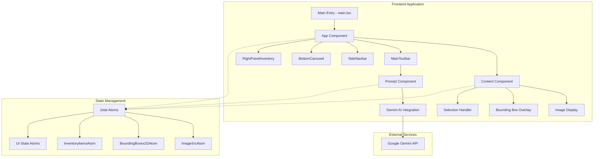
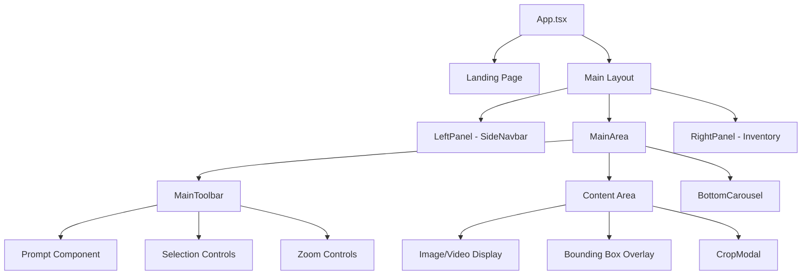
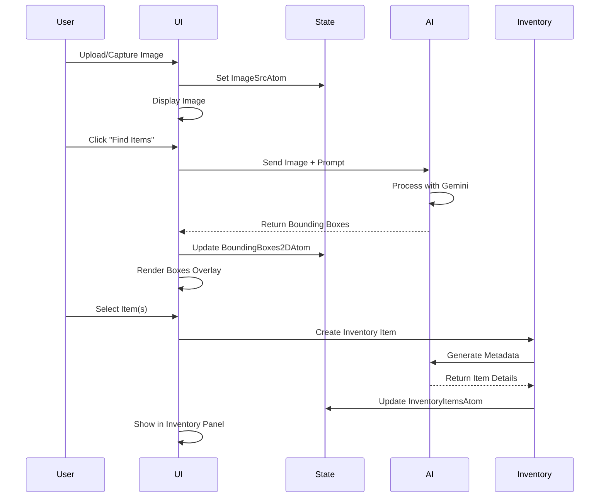
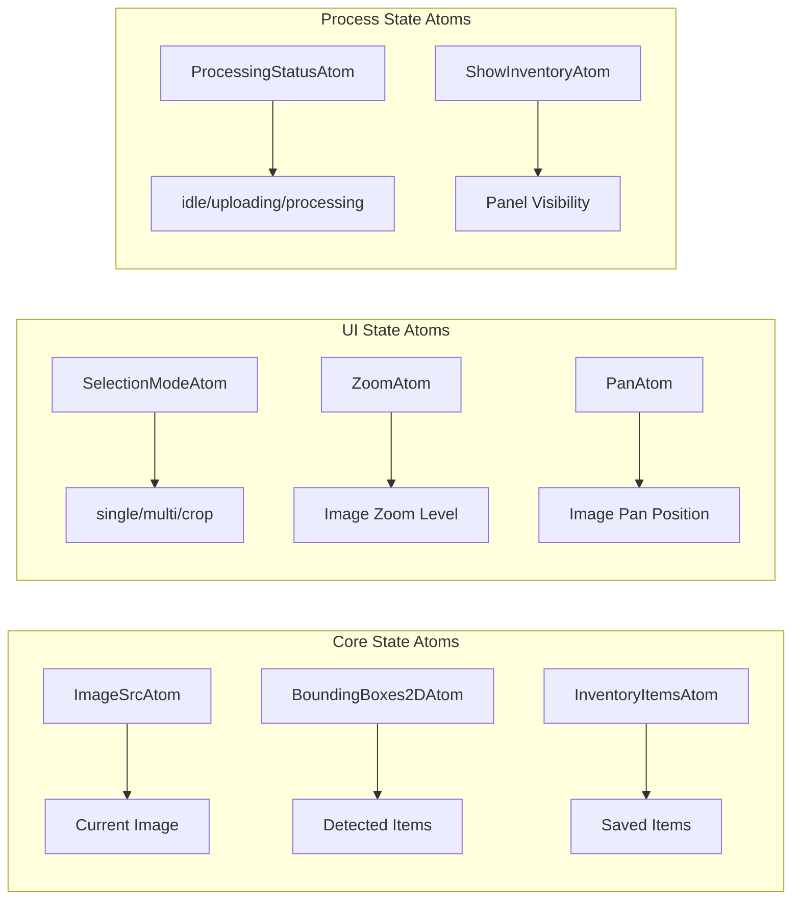
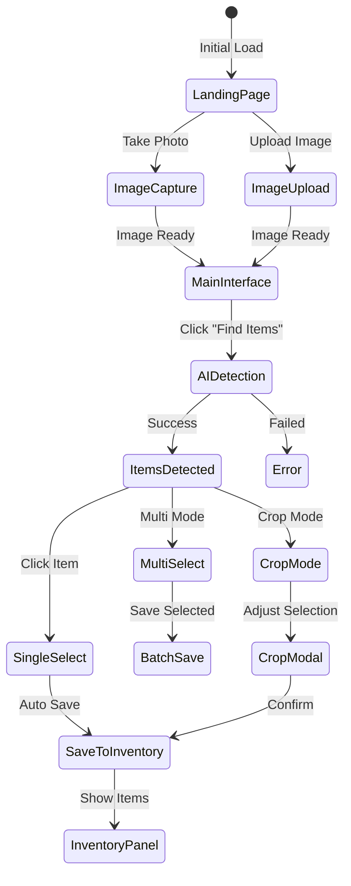

# Google SDK Spatial Understanding - Project Analysis Report

## Executive Summary

**The Itemizer** is an AI-powered household inventory management system built with React, TypeScript, and Google's Gemini AI. It enables users to automatically detect, catalog, and manage household items through image analysis.

### Key Features
- 🤖 AI-powered object detection using Google Gemini
- 📸 Image upload and camera capture support
- 🎯 Interactive bounding box selection
- 📦 Inventory management system
- 🔍 Multiple selection modes (single, multi, crop)
- 🎨 Modern, responsive UI with DaisyUI

## Architecture Overview



## Component Hierarchy



## Data Flow



## Core Type System

```typescript
// Detection Types
export type DetectTypes =
  | '2D bounding boxes'
  | 'Segmentation masks'
  | '3D bounding boxes'
  | 'Points';

// Bounding Box Structure
export type BoundingBox2DType = {
  x: number;        // 0-1 normalized
  y: number;        // 0-1 normalized
  width: number;    // 0-1 normalized
  height: number;   // 0-1 normalized
  label: string;    // AI-generated label
};

// Inventory Item Structure
export type InventoryItemType = {
  id: string;
  imageUrl: string;
  label: string;
  category?: string;
  tags?: string[];
  dateAdded: string;
  sourceImageUrl?: string;
  notes?: string;
  originalBox?: BoundingBox2DType;
  metadata?: ItemMetadata;
};

// Item Metadata (AI-generated)
export type ItemMetadata = {
  brand?: string;
  condition?: string;
  resaleValue?: string;
  manufacturerWebsite?: string;
  documentationLinks?: string[];
  warrantyInfo?: string;
  description?: string;
};
```

## State Management Architecture



## Critical Code Components

### 1. AI Integration (Prompt.tsx)

```typescript
// AI Prompt Construction
const get2dPrompt = () =>
  `Detect ${targetPrompt} in this image. Focus on identifying individual household items...
  
Output ONLY a valid JSON array where each entry is:
- "box_2d": [ymin, xmin, ymax, xmax] as percentages 0-1000
- "label": descriptive label with item type and features

Example: [{"box_2d": [100, 200, 300, 400], "label": "Black ceramic coffee mug"}]`;

// AI Processing Flow
async function handleSend() {
  // 1. Initialize Gemini AI
  const model = ai.getGenerativeModel({ model: 'gemini-1.5-flash' });
  
  // 2. Prepare image data
  const requestParts: Part[] = [
    { inlineData: { mimeType: 'image/png', data: base64Data } },
    { text: get2dPrompt() }
  ];
  
  // 3. Generate content
  const result = await model.generateContent({
    contents: [{role: 'user', parts: requestParts}],
    generationConfig: { temperature: 0.5 }
  });
  
  // 4. Parse and transform response
  const boxes = parseAIResponse(result.response.text());
  setBoundingBoxes2D(boxes);
}
```

### 2. Item Selection & Inventory Management (Content.tsx)

```typescript
// Selection Handler
const handleBoxClick = useCallback((boxIndex: number, box: any, e: React.MouseEvent) => {
  e.stopPropagation();
  
  if (selectionMode === 'multi') {
    // Toggle selection
    const newSelected = new Set(selectedBoxes);
    newSelected.has(boxIndex) 
      ? newSelected.delete(boxIndex) 
      : newSelected.add(boxIndex);
    setSelectedBoxes(newSelected);
  } else if (selectionMode === 'crop') {
    // Open crop modal
    setSelectedBox(box);
    setShowCropModal(true);
  } else {
    // Single selection - save to inventory
    handleSaveToInventory(box, boxIndex);
  }
}, [selectionMode, selectedBoxes]);

// Inventory Item Creation
const createInventoryItem = async (box: any) => {
  const inventoryItem = {
    id: generateUniqueId(),
    imageUrl: await cropBoxToImage(box),
    label: box.label,
    category: box.label.split(' ')[0],
    tags: [box.label],
    dateAdded: new Date().toISOString(),
    sourceImageUrl: effectiveImageSrc,
    originalBox: box,
    metadata: await generateItemMetadata(effectiveImageSrc, box.label),
  };
  return inventoryItem;
};
```

### 3. Image Processing & Cropping

```typescript
// Crop bounding box to individual image
const cropBoxToImage = async (box: any): Promise<string> => {
  const img = new Image();
  img.src = effectiveImageSrc;
  
  await new Promise(resolve => img.onload = resolve);
  
  const canvas = document.createElement('canvas');
  const ctx = canvas.getContext('2d');
  
  // Calculate pixel coordinates from normalized values
  const cropWidth = Math.round(box.width * img.width);
  const cropHeight = Math.round(box.height * img.height);
  const cropX = Math.round(box.x * img.width);
  const cropY = Math.round(box.y * img.height);
  
  canvas.width = cropWidth;
  canvas.height = cropHeight;
  
  // Draw cropped portion
  ctx.drawImage(img, cropX, cropY, cropWidth, cropHeight, 0, 0, cropWidth, cropHeight);
  
  return canvas.toDataURL('image/png', 1.0);
};
```

## User Interface Flow



## Key Features Implementation

### 1. Zoom & Pan Controls
- **Ctrl + Scroll**: Zoom in/out (0.5x - 5x)
- **Ctrl + Drag**: Pan image
- **Reset Button**: Return to 1x zoom, center position

### 2. Selection Modes
- **Single**: Click to save immediately
- **Multi**: Select multiple items, batch save
- **Crop**: Custom crop area selection

### 3. AI Integration
- Uses Google Gemini 1.5 Flash model
- Processes images up to 768px for performance
- Returns JSON with bounding boxes and labels
- Handles error cases and malformed responses

### 4. Inventory Management
- Automatic metadata generation
- Image cropping for each item
- Duplicate detection
- Export capabilities

## Performance Optimizations

1. **Image Resizing**: Max 768px before AI processing
2. **Lazy Loading**: Components load on demand
3. **State Management**: Jotai atoms for efficient updates
4. **Batch Operations**: Multi-select for bulk actions

## Security Considerations

1. **API Key Management**: Uses Vite environment variables
2. **Client-Side Processing**: No server dependency
3. **Data Storage**: Local state only (no persistence)

## Future Enhancements

1. **Data Persistence**: Add local storage or database
2. **Export Features**: CSV, PDF inventory reports
3. **Advanced AI Models**: Support for Gemini Pro
4. **Collaboration**: Share inventories
5. **Mobile App**: React Native version

## Technical Stack

- **Frontend**: React 19 + TypeScript
- **State**: Jotai (atomic state management)
- **Styling**: Tailwind CSS + DaisyUI
- **AI**: Google Generative AI (Gemini)
- **Build**: Vite
- **Drawing**: Perfect Freehand (for annotations)

## Conclusion

The Itemizer represents a modern approach to household inventory management, leveraging cutting-edge AI technology to simplify the cataloging process. Its modular architecture and clean code structure make it easily extensible for future enhancements. 